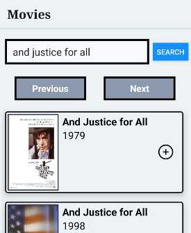

## Movie Browser

This is a project where I've programmed an app in React Native that works on Android or IOS. In addition 
to being able to search for movies from database and view information about them, you are also able to 
create an account, favorite movies, add movies to a watch later list, and change what details are shown when
viewing a movie's information. There is also the ability to create a user account on a mock login 
implementation (the login features all work locally rather than on a seperate server). It is not published
on any app stores.

You can run this app using the expo go phone on your app. First start the server:

```bash
npx expo start
# or if you're on windows
npx expo start --tunnel
```

Then scan the QR code that pops up in the terminal using expo go.

Alternatively, this project can be ran through an emulator on the browser located [here](https://snack.expo.dev/@hatanh/movie-browser)

# Image


